# reco_bench — 추천 시스템 벡터 검색 벤치마크
## VDPU 의 가치를 어디서·어떻게 증명하는가

> **대상 청중**: VDPU 개발자 · 벡터DB 개발자 · 추천 시스템을 잘 모르는 일반 사용자
> **한 줄 요약**: "추천이 빨라지는 진짜 병목(ANN 벡터 검색)을 공정하게 재는 자(尺)를 만들었고,
> 그 자 위에서 GPU 가속이 **언제** 이기는지 데이터로 보였다. 그 다음 칸이 VDPU 다."

---

## 0. 발표의 지도 (목차)

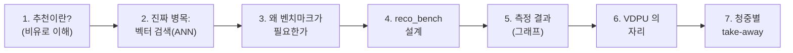

---

## 1. 추천 시스템이란? — 도서관 사서 비유

쿠팡에 접속하면 "당신을 위한 추천 상품"이 뜹니다. 수천만 개 상품 중에서
**당신이 살 만한 10개**를 0.1초 안에 골라야 합니다.

> 📚 **비유**: 1억 권의 책이 있는 도서관에서, 당신의 취향을 들은 사서가
> "이 10권 어때요?" 를 **눈 깜짝할 사이에** 골라주는 것.

이걸 컴퓨터로 하는 표준 방법이 **Two-tower(투-타워) 모델** 입니다.

### Two-tower 모델 — "취향을 숫자 벡터로"

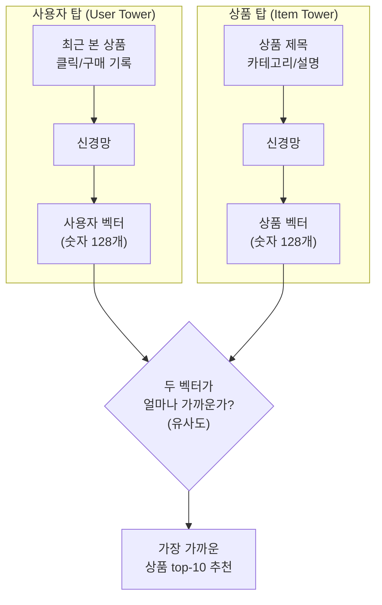

**핵심 아이디어**: 사용자와 상품을 각각 **128개 숫자로 된 벡터(점)** 로
바꾼다. 두 점이 **가까우면** "취향이 맞다"는 뜻. 추천 = **내 점에서
가장 가까운 상품 점 10개 찾기**.

> 🎯 **일반 사용자용 한 줄**: 추천은 결국 "고차원 공간에서 내 점과
> 가장 가까운 점들 찾기" 라는 **기하학 문제** 입니다.

---

## 2. 진짜 병목은 "벡터 검색(ANN)" 이다

상품이 1억 개면, 내 벡터와 **1억 개 상품 벡터의 거리를 다 계산**해서
가장 가까운 10개를 찾아야 합니다. 이게 추천 서비스에서 **돈과 시간을
가장 많이 잡아먹는 단계** 입니다.


### 정확히 다 비교하면 너무 느리다 → ANN

1억 개를 일일이 다 비교(brute-force)하면 정확하지만 **너무 느리고
비쌉니다**. 그래서 현실에선 **ANN (Approximate Nearest Neighbor,
근사 최근접 이웃)** 을 씁니다.

> 🔍 **비유**: 도서관에서 1억 권을 다 뒤지지 않고, **장르별 서가**로
> 먼저 좁힌 뒤 그 안에서만 찾는 것. 약간의 누락(정확도↓)을 감수하고
> **100배 빠르게** 찾는 기술.

| 방식 | 비유 | 속도 | 정확도 |
|---|---|---|---|
| Brute-force | 1억 권 전부 확인 | 매우 느림 | 100% |
| **ANN** | 관련 서가만 확인 | **수십~수백배 빠름** | 95%+ (조절 가능) |

ANN 을 빠르게 해주는 도구들이 시장에 많습니다:
- **라이브러리**: FAISS(Meta), ScaNN(Google), cuVS(NVIDIA)
- **벡터 DB**: Milvus, Qdrant, Weaviate, Pinecone …
- **전용 하드웨어**: 디노티시아 **VDPU** ← 우리가 증명하려는 것

---

## 3. 왜 "또" 벤치마크가 필요했나

기존 벤치마크들은 우리 질문에 답하지 못했습니다:

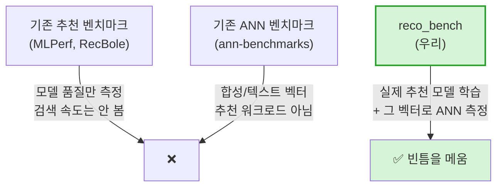

- 추천 벤치마크는 **"얼마나 잘 맞히나"(품질)** 만 보고 **"얼마나 빠른가"**
  는 안 봅니다.
- ANN 벤치마크는 빠르기는 재지만 **추천이 아닌 벡터** 로 잽니다.
- `reco_bench` 는 **실제 추천 모델을 학습 → 그 상품 벡터 위에서 ANN 을
  측정** 합니다. 그래서 숫자가 추천 현장을 대표합니다.

참고한 공개 표준: **ann-benchmarks**(Recall-QPS 곡선), **MLPerf DLRM**
(지연 측정), **VectorDBBench**(다중 DB 비교).

---

## 4. reco_bench 는 어떻게 측정하나

### 4.1 공정성의 핵심 — "같은 정확도에서 비교한다 (iso-recall)"

속도만 보면 속을 수 있습니다. **정확도를 희생하면 누구나 빨라지기**
때문입니다. 그래서 **같은 정확도(recall)에서 누가 더 빠른가** 를 봅니다.

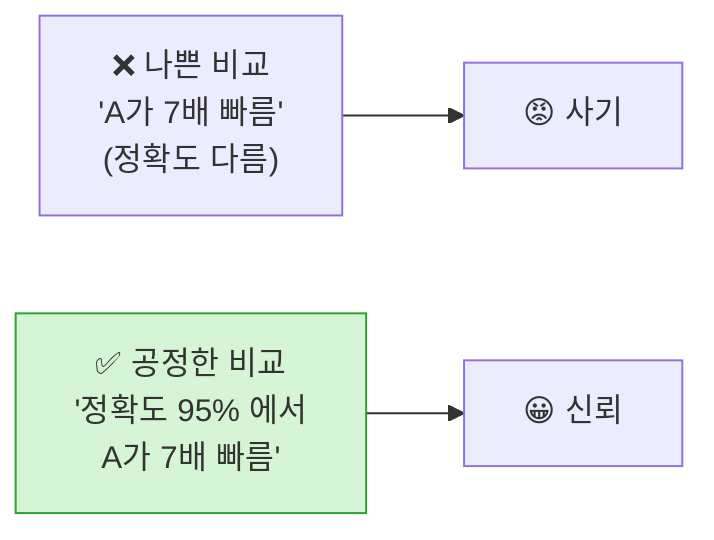

### 4.2 두 가지 정확도 — 모델 탓 vs 검색 탓을 분리

| 지표 | 정답 기준 | 측정 대상 |
|---|---|---|
| Recall vs **Ground Truth** | 사용자가 실제로 산 상품 | 모델 + 검색 (전체 품질) |
| Recall vs **Exact** | brute-force 정답 | **순수 검색기 정확도** ← 가속기 비교 기준 |

> 💡 이렇게 분리하면 "검색기가 빠른 게 모델이 나빠서인가, 검색이
> 좋아서인가" 같은 혼동을 원천 차단합니다. 가속기 비교는 항상
> **vs exact** 로 합니다.

### 4.3 측정하는 것들

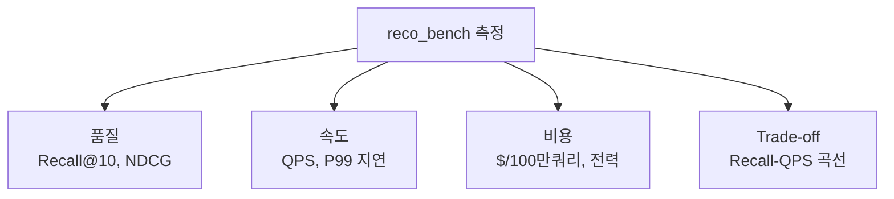

### 4.4 한 명령으로 끝 — "벡터 DB 를 쉽게 추가"


새 검색기(벡터 DB, 또는 **VDPU**)를 추가하려면 **파일 1개 + 설정 1줄**
이면 됩니다. 모든 검색기가 `Retriever` 라는 공통 인터페이스 뒤에 숨기
때문입니다.

```python
# 모든 검색기(FAISS, Milvus, Qdrant, VDPU…)가 구현하는 공통 약속
class Retriever:
    def build(item_vectors): ...   # 인덱스 만들기
    def search(query, k): ...      # 가장 가까운 k개 찾기
```

---

## 5. 측정 결과 (그래프로 보기)

> 데이터셋: **MovieLens-25M**(영화 2.4만), **Amazon Reviews 2023**(상품
> 16만), 그리고 synthetic(최대 1천만). 하드웨어: **NVIDIA H100 GPU 1장**
> + CPU(EPYC, 128 thread 고정).

### 5.1 핵심 그래프 — Recall vs 속도 (Pareto 곡선)

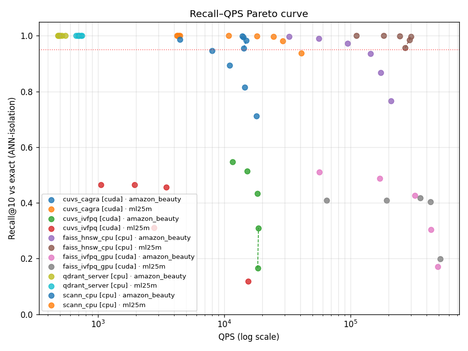

**읽는 법**: 오른쪽 위로 갈수록 좋다(빠르고 정확). 같은 높이(정확도)에서
오른쪽에 있는 점이 더 빠른 검색기.

### 5.2 검색기별 속도 비교 (같은 정확도 0.95 기준)

| 검색기 | 종류 | 장치 | 속도(QPS) | 비용($/100만) |
|---|---|---|---|---|
| FAISS-CPU HNSW | 라이브러리 | CPU | 32,745 | $0.012 |
| FAISS-GPU IVF-PQ | 라이브러리 | GPU | **56,810** | $0.003 |
| cuVS CAGRA | 라이브러리 | GPU | 13,839 | $0.098 |
| ScaNN | 라이브러리 | CPU | 4,464 | $0.088 |
| **Qdrant (벡터 DB 서버)** | DB | CPU | 550 | $0.718 |

*(Amazon Beauty, 16만 상품 기준. 전체 표는 [`baseline_results.md`](baseline_results.md).)*

> 🔑 **벡터 DB(Qdrant)가 느린 이유**: 엔진이 느린 게 아니라, **네트워크
> 왕복(질의를 서버에 보내고 받기)** 비용 때문. 운영 편의성(분산·영속성)의
> 대가입니다. → 가속기 비교는 "같은 배포 형태끼리" 해야 공정.

### 5.3 비용 비교

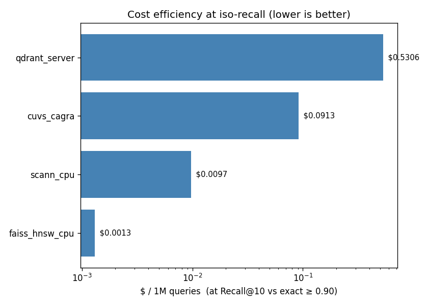

### 5.4 지연 분포 (P99 — 99%의 사용자가 체감하는 최악 지연)

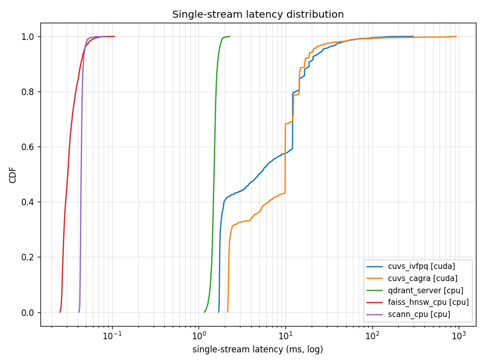

**읽는 법**: 곡선이 **왼쪽**에 있을수록 빠르고 일관적. 추천 서비스는
평균이 아니라 **P99**(곡선의 99% 지점)로 품질을 약속합니다.

### 5.5 ⭐ 가장 중요한 결과 — "데이터가 커질수록 GPU 가 이긴다"

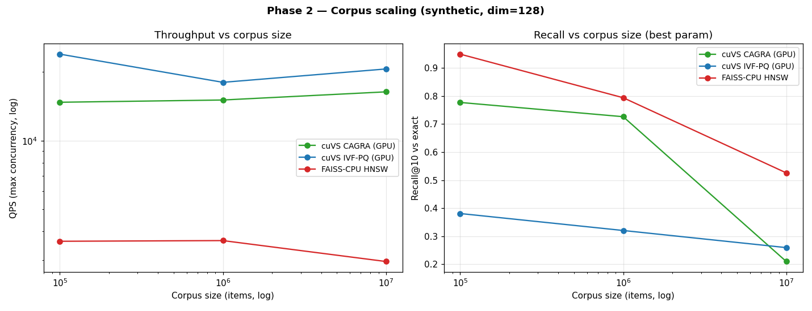

```
상품 수:        10만      →     1천만  (100배 증가)
─────────────────────────────────────────────────
GPU (cuVS CAGRA):  14,744  →   16,381 QPS  (유지/상승 👍)
CPU (FAISS HNSW):   3,622  →    2,952 QPS  (하락 👎)
─────────────────────────────────────────────────
속도 격차:           4.1배  →     5.5배   (점점 벌어짐)
```

> 🎯 **이것이 영업의 핵심**: 작은 데이터에선 CPU 도 충분하지만,
> **쿠팡 규모(수천만~수억 상품)에선 GPU급 가속이 필수** 가 된다.
> 그리고 **VDPU 는 그 GPU 자리를 더 싸게/빠르게 노린다.**

### 5.6 고차원일수록 GPU 유리

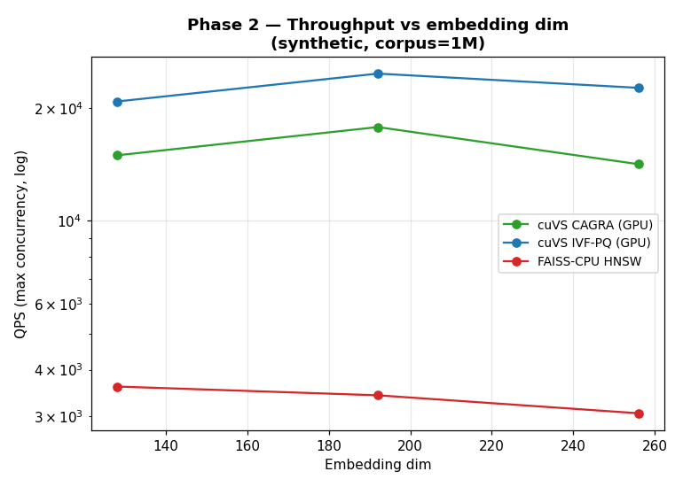

벡터 차원이 커질수록(LLM 임베딩 트렌드) CPU 의 속도·정확도가 함께
떨어지고, GPU 는 상대적으로 버팁니다.

---

## 6. VDPU 의 자리 — "다음 칸을 채운다"

지금까지는 **CPU vs GPU** 를 공정한 자(尺) 위에 올렸습니다. 그 자 위에
**VDPU 한 줄을 추가** 하는 것이 다음 단계(Phase 2)입니다.

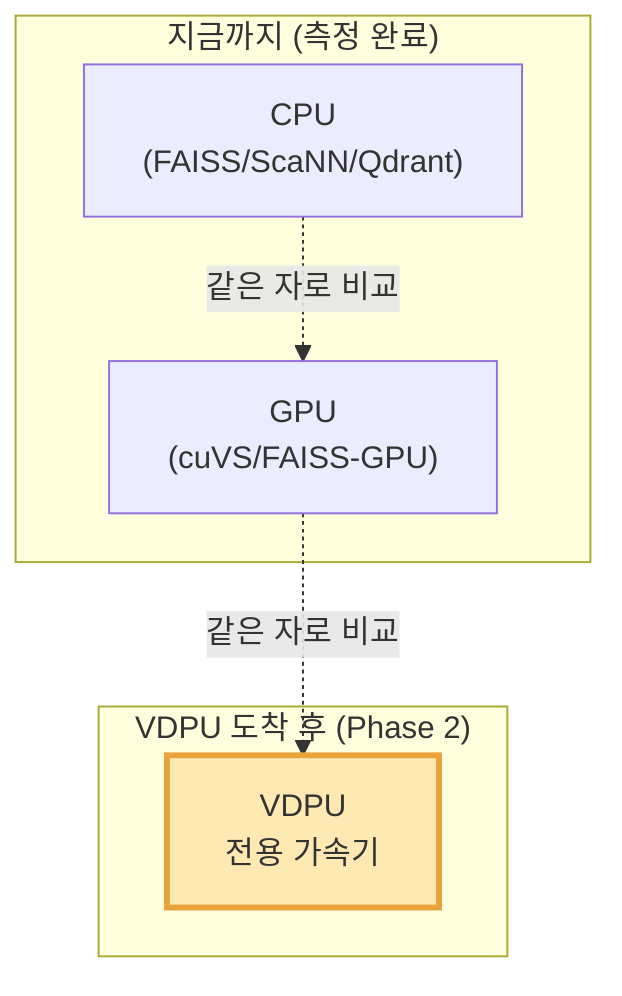

### VDPU 가 증명해야 할 숫자 (이미 정의됨)

> **iso-recall 비용비율** =
> (정확도 95%에서 GPU 의 $/쿼리) ÷ (정확도 95%에서 VDPU 의 $/쿼리)
>
> 이 값이 **6~7×** 이면 "GPU 대비 6~7배 가성비" 주장이 **데이터로 증명**됨.

VDPU 통합은 **코드 1파일 + 설정 2줄**이면 끝나도록 이미 설계돼 있습니다
(`Retriever` 인터페이스). 하드웨어가 도착하면 같은 그래프에 VDPU 곡선이
자동으로 겹쳐집니다.

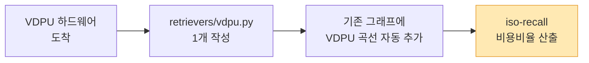

---

## 7. 청중별 Take-away

### 👨‍💻 VDPU 개발자에게
- **공정한 비교 무대가 이미 준비됨**. VDPU 는 `Retriever` 1개만 구현하면
  CPU/GPU 와 같은 자로 측정됩니다.
- 목표 숫자가 명확: **iso-recall(0.95)에서 $/쿼리를 GPU 대비 1/6~1/7 로**.
- 측정이 노릴 영역도 명확: **대규모 corpus + 고차원** (CPU 가 무너지고
  GPU 가 버티는 구간 = VDPU 가 빛날 구간).

### 🗄️ 벡터 DB 개발자에게
- 벡터 DB 의 **네트워크 오버헤드** 가 throughput 에 크게 작용함을 데이터로
  확인 (Qdrant 550 QPS vs in-process 라이브러리 만~수십만 QPS).
- 단, 이건 **batch API 미사용 lower bound** — batch 검색으로 개선 여지 큼.
- 운영 편의성(분산/영속성)과 raw 속도의 trade-off 를 정량적으로 보여줌.

### 🙋 일반 사용자/의사결정자에게
- 추천의 숨은 비용은 **"가장 가까운 상품 찾기(벡터 검색)"** 에 있습니다.
- **데이터가 클수록 전용 가속(GPU·VDPU)의 비용 절감 효과가 커집니다.**
- 이 벤치마크는 그 효과를 **공정하고 재현 가능하게** 숫자로 증명하는 도구
  입니다. (오픈소스로 누구나 검증 가능)

---

## 8. 요약 (한 장)

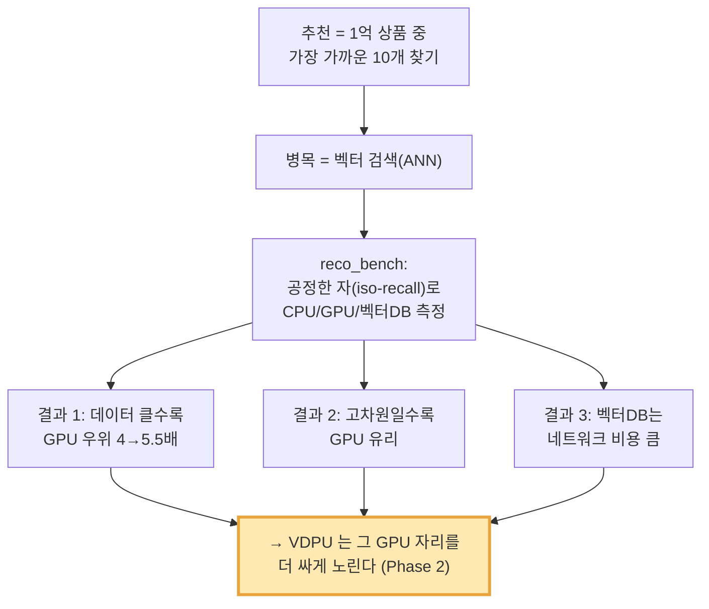

---

## 부록 — 자료/재현

- **코드/문서**: github.com/dn-inc/dn-reco-bench (오픈소스 예정)
- **상세 결과**: [`baseline_results.md`](baseline_results.md),
  [`06_phase1_findings.md`](06_phase1_findings.md),
  [`07_scaling.md`](07_scaling.md)
- **방법론**: [`01_metric_design.md`](01_metric_design.md),
  [`03_baseline_methodology.md`](03_baseline_methodology.md)
- **VDPU 가치 수식**: [`04_vdpu_value_proposition.md`](04_vdpu_value_proposition.md)
- **재현**: [`05_reproducibility.md`](05_reproducibility.md) — 한 명령으로
  전체 재현 가능

> ⚠️ **정직성 노트**: 본 자료의 GPU/CPU 수치는 H100 1장 기준 측정값이며,
> Two-tower 모델은 sanity 수준(품질보다 검색기 비교가 목적)입니다.
> IVF-PQ 계열의 낮은 recall, 벡터 DB 의 batch 미사용 등 한계는 각
> 상세 문서에 명시돼 있습니다. VDPU 곡선은 **하드웨어 도착 후** 실측으로
> 채워집니다 (현재는 빈 자리).
