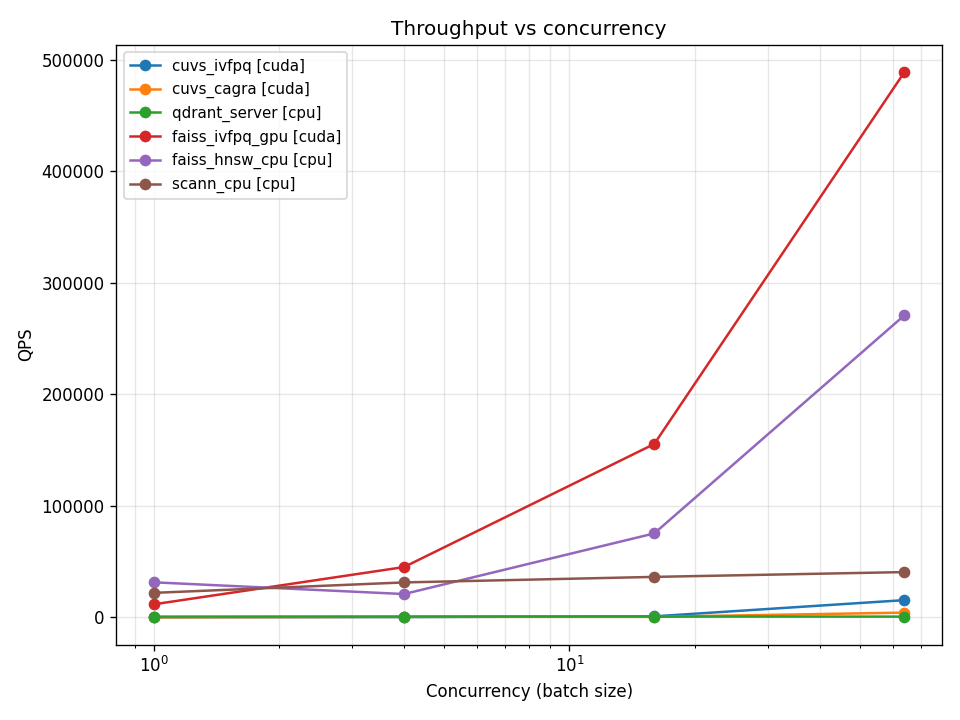
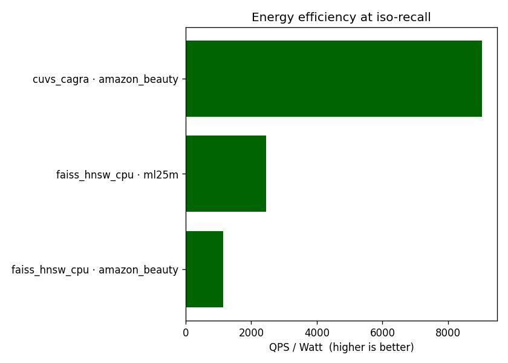

# baseline_results.md — 자동 생성

> 이 파일은 `scripts/99_make_report.sh` 가 자동 생성합니다. 직접 편집
> 하지 마세요. 메트릭 정의는 [`01_metric_design.md`](01_metric_design.md),
> 방법론은 [`03_baseline_methodology.md`](03_baseline_methodology.md) 참조.

## 메인 결과 표

각 (dataset, retriever) 조합에서 **Recall@10 vs exact 가 가장 높은 grid
점** 의 결과 (동일 recall 이면 QPS 가 더 큰 쪽 선택).

| Dataset | Retriever | Device | Recall@10 (vs exact) | Recall@10 (vs GT) | NDCG@10 | QPS (max c) | P99 ms | $/1M | W/QPS |
|---|---|---|---|---|---|---|---|---|---|
| amazon_beauty | cuvs_cagra | cuda | 0.9993 | 0.0077 | 0.0048 | 13,839 | 12.38 | $0.0984 | 0.00 |
| amazon_beauty | cuvs_ivfpq | cuda | 0.5477 | 0.0076 | 0.0050 | 11,599 | 6.97 | $0.1173 | 0.00 |
| amazon_beauty | faiss_hnsw_cpu | cpu | 0.9973 | 0.0077 | 0.0048 | 32,745 | 1.25 | $0.0120 | 0.00 |
| amazon_beauty | faiss_ivfpq_gpu | cuda | 0.5102 | 0.0075 | 0.0047 | 56,810 | 0.23 | $0.0240 | 0.00 |
| amazon_beauty | qdrant_server | cpu | 1.0000 | 0.0077 | 0.0048 | 550 | 2.41 | $0.7177 | 0.22 |
| amazon_beauty | scann_cpu | cpu | 0.9874 | 0.0077 | 0.0048 | 4,464 | 0.58 | $0.0884 | 0.03 |
| ml25m | cuvs_cagra | cuda | 1.0000 | 0.0195 | 0.1161 | 4,469 | 77.15 | $0.3046 | 0.02 |
| ml25m | cuvs_ivfpq | cuda | 0.4649 | 0.0231 | 0.1304 | 1,055 | 61.03 | $0.9695 | 0.05 |
| ml25m | faiss_hnsw_cpu | cpu | 1.0000 | 0.0195 | 0.1161 | 183,096 | 0.19 | $0.0022 | 0.00 |
| ml25m | faiss_ivfpq_gpu | cuda | 0.4181 | 0.0150 | 0.0848 | 356,097 | 0.11 | $0.0038 | 0.00 |
| ml25m | qdrant_server | cpu | 1.0000 | 0.0195 | 0.1161 | 743 | 1.79 | $0.5306 | 0.16 |
| ml25m | scann_cpu | cpu | 1.0000 | 0.0195 | 0.1161 | 10,852 | 0.33 | $0.0363 | 0.01 |

## Iso-recall speedup (Recall@10 vs exact ≥ 0.95)

각 dataset 안에서 가장 느린 retriever 를 1× 로 두고, 다른 retriever 의 QPS 배수.

| Dataset | Retriever | Device | QPS | Speedup vs slowest |
|---|---|---|---|---|
| amazon_beauty | qdrant_server | cpu | 550 | 1.00× |
| amazon_beauty | scann_cpu | cpu | 4,464 | 8.12× |
| amazon_beauty | cuvs_cagra | cuda | 14,909 | 27.13× |
| amazon_beauty | faiss_hnsw_cpu | cpu | 95,151 | 173.12× |
| ml25m | qdrant_server | cpu | 743 | 1.00× |
| ml25m | cuvs_cagra | cuda | 4,469 | 6.01× |
| ml25m | scann_cpu | cpu | 28,959 | 38.95× |
| ml25m | faiss_hnsw_cpu | cpu | 300,707 | 404.48× |

## 시각화

### Recall-QPS Pareto 곡선

곡선의 점선은 retriever × dataset 별 Pareto frontier. 빨간 점선은
iso-recall = 0.95 비교 기준선 (`reports/01_metric_design.md §4.1`).

### Single-stream latency 분포

### Cost @ iso-recall (≥0.90)

### Throughput vs concurrency

### Throughput per Watt @ iso-recall (≥0.90)

전력 측정이 가능한 경우에만 표시. CPU 만 사용한 retriever 는 보통
NVML 샘플링 결과가 0 이라 제외된다.

## 데이터 소스

- 메트릭: `results/<exp_id>/metrics.json`
- 집계 CSV: `results/<exp_id>/aggregate.csv`
- 하드웨어: `results/<exp_id>/hardware.json`
- 비용 모델: `configs/cost_model.yaml`

## 주의 (현재 단계 한계)

본 자동 생성 결과는 ML-25M sanity check 단계의 측정이다. 본 표의 절대
값보다 **retriever × hardware 간 상대 비교** 에 의미를 둔다. 그래도
`Recall@10 vs ground truth` 가 낮다면 모델 학습이 부족한 신호이며,
`Recall@10 vs exact` 는 ANN 알고리즘 자체의 정확도라 모델 품질과 독립.
